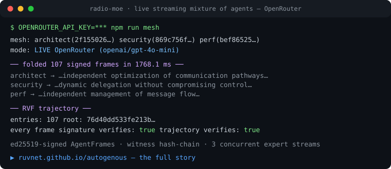

<div align="center">

# 🧬 Autogenous

### Governed Evolutionary Software

**Autogenous turns runtime failures into verified, portable, reversible software adaptations.**

[](./.github/workflows/ci.yml)
[](./LICENSE)
[](#workspace)
[](#honest-status)

**[▶ The story](https://ruvnet.github.io/autogenous/)** · **[ADRs](./docs/adr)** · **Formal system:** Autogenous Runtime · **Protocol:** AGL · **Adaptation:** AAP

[](https://ruvnet.github.io/autogenous/)

</div>

---

> A governed operating system for software that can **learn from production, redesign parts of itself, prove the redesign is better, deploy it safely, and reverse it when wrong.** Not artificial life. Not a magical self-rewriting repository. Not another agent framework — an **evolutionary control plane**.

## The loop

```
observe production → explain failures → generate adaptations → test against parent
      ▲                                                              │
      └── promote-or-rollback ← canary 1→10→50→100% ← proof gates ◄──┘
```

Every change is a **typed mutation** (the Autogenous Genome Language, **AGL**) that must declare: what it changes · why it should work · where it is valid · what authority it requires · which invariants it preserves · how it was tested · when it expires · how to reverse it. Unstructured source patches can't say any of that.

The first executable profile is the **Autogenous Antibody Package (AAP)**: a signed, capability-constrained, *expiring* adaptation — trigger, evidence, detector, containment, regression corpus, fitness envelope, lineage, rollback.

## Structural guarantees (in the types, not in policy docs)

- **Authority never silently expands** — a mutation may request *less* authority than its parent's ceiling, never more (`agl-types`, enforced in `Mutation::admissible`).
- **The constitution is outside the loop** — hash-pinned, externally governed; `MutationScope::Constitutional` is *never* auto-promotable (`constitution`).
- **Promotion is a hard AND-gate over a fitness vector** — `min`-semantics; exceptional quality can never compensate for a safety or governance miss (`FitnessVector::passes_hard_gates`).
- **Irreversible mutations are inadmissible** — no rollback target, no admission.
- **Statistical triggers can't authorize irreversible actions** — a learned detector may quarantine or buffer, never terminate (`antibody`).
- **Zero unsigned promotions** — the canary controller cannot reach `Promoted` without a signature (`promotion`).

## Workspace

| Crate | ADR-392 phase | What it does |
|---|---|---|
| [`constitution`](./crates/constitution) | P1 | Immutable, hash-pinned, externally-governed authority document; change-checking (≥2 signers + migration path) without change-applying |
| [`agl-types`](./crates/agl-types) | P2 | Genomes, typed mutations, authority classes, mutation scopes, hard invariants, vector fitness + hard gates |
| [`verifier`](./crates/verifier) | P3 | Deterministic admission verdicts with full failure explanations — independently re-runnable |
| [`antibody`](./crates/antibody) | P4 | AAP: triggers (symbolic vs statistical), containment, privacy-ruled evidence, expiration/renewal |
| [`evaluator`](./crates/evaluator) | P5 | Replay a detector over labeled corpora → recall/FP with Wilson-interval uncertainty → fitness vector |
| [`promotion`](./crates/promotion) | P6 | Staged canary (1→10→50→100%), signed promotion, automatic rollback on the first gate violation |
| [`midstream-adapter`](./crates/midstream-adapter) | MVP #2 | Stream observation: armed antibodies over live chunks/SSE → structured incidents with derived evidence; rolling window catches chunk-boundary attacks |
| [`witness`](./crates/witness) | §4.5/§13 | ed25519 signing, content addressing, append-only signed witness chain + per-artifact seals |
| [`lineage`](./crates/lineage) | §5/§10 | Append-only content-addressed provenance DAG + quality-diversity archive (poor performers retained, not deleted) |
| [`autogenous-generator`](./crates/generator) | MVP #3 | Synthesizes a *diverse population* of typed candidates from witnessed evidence — **never sees the evaluator's labels** (separation) |
| [`envelope`](./crates/envelope) | **ADR-394** | **Cryptographically-closed promotion**: content-bound manifests, signed evaluation receipts (≥2 pinned judges, beats-parent), signed promotion envelope; `verify_promotion` returns *every* violation |
| [`deployment`](./crates/deployment) | **ADR-394 #6** | Two-phase **verified** rollback: a `DeploymentAdapter` *commands* restoration, confirms the active artifact hash + health, and emits an ed25519-signed `RollbackReceipt` — rollback is executed and confirmed, not merely decided |
| [`runtime`](./crates/runtime) | §9/§14 | The self-running loop on the closed path, with a `Clock` abstraction and measured rollback/restore SLOs |

**Cryptographically closed** (ADR-394 — security-review remediation): the promotion transition depends on **independently-verified, content-bound evidence, never caller-supplied booleans or strings.** `promote("")` is impossible; the verifier consumes **ed25519-signed evaluation receipts from ≥2 distinct pinned judges** measuring candidate-vs-parent on the same corpus; a candidate must **beat its parent** with a non-inferiority margin; effects/rollback-target/invariant-proofs are inside the content-addressed manifest. The adversarial acceptance test rejects a maximally-malicious candidate for **≥6 independent reasons before any canary**. CI enforces `fmt` + `clippy -D warnings` + `cargo audit`.

P7 (invented representations / semantic airlock) is ongoing research by definition — it has a specified contract (ADR-392 §7), not fake results.

```bash
cargo test   # 71 tests, including the end-to-end acceptance lifecycle
```

**Measured** (release, Ryzen host, `cargo run --release -p midstream-adapter --example perf`):
stream observation ≈ **0.9 µs/chunk** with 1 armed antibody (≈ 14 µs with 16) — ~350× inside the <5 ms p99 SLO; replay of **100,000 labeled streams in ~7 ms**; canary decision ≈ 2 ns. Detectors are **serializable artifacts** (a closed combinator algebra with enforced resource bounds — no closures, no regex engine), and the incident adapter catches **attacks split across chunk boundaries** via a rolling window.

The lifecycle test proves the flow offline: a novel prompt attack becomes an antibody candidate → the verifier admits it → replay over 4,000 labeled streams measures recall ≥ 99% and FP < 0.5% → the canary walks 1→10→50→100% → **signed** promotion. A deliberately-inserted capability expansion is **rejected even with perfect fitness**, and an injected regression **rolls back automatically** mid-canary.

## Streaming mixture of agents (`packages/radio-moe`)

The TypeScript companion (ADR-395–402): a **real-time streaming, P2P mixture of
agents**. AgentRadio (`@metaharness/radio`) is the metadata-only local control
plane; an **ed25519-signed** transport carries typed `AgentFrame`s; experts run
on real backends — `claude -p` / `codex exec` subprocess streaming, **OpenRouter**
and **Gemini-on-GCP** SSE adapters. Signed frames fold into a `MixtureState`,
release through an independence-weighted `ActionGate`, and evolve via a governed
flywheel. Every run is packaged as an **RVF-style witness trajectory**
(hash-chained, tamper-evident).

Docs: **[README](packages/radio-moe/README.md)** ·
**[User Guide](packages/radio-moe/docs/USER-GUIDE.md)** ·
**[API / SDK](packages/radio-moe/docs/API.md)** ·
**[Custom MetaHarness](packages/radio-moe/docs/METAHARNESS.md)**.

```bash
cd packages/radio-moe
npm test              # 87 offline deterministic tests (incl. adversarial E2E)
npm run mesh          # 3-peer mesh — offline fake experts, or LIVE with OPENROUTER_API_KEY
npm run bench:fusion  # does the fused mixture beat the strongest single expert?
```

**Fusion measured** (`npm run bench:fusion`, deterministic): fusing *independent*
experts beats the strongest single expert (+33.3%); a confidently-wrong
same-lineage cluster drags naive-vote **and** sourceId de-dup *below* best-single,
and only **lineage-weighted `effectiveSupport`** recovers it (+25%). Independence
must be measured by lineage, not just shared sources (ADR-401).

**Live-verified** (2026-08-16): single-model — 107 signed frames from 3
concurrent `gpt-4o-mini` streams in **1.77 s**, 107/107 verified. Heterogeneous —
the four newest frontier models (`claude-opus-5-fast` · `gemini-3.7-flash` ·
`grok-4.6` · `kimi-k3`) as one mixture: **114 signed frames in 14.5 s**, 114/114
verified, trajectory root re-derived, with organic cross-model consensus.
MetaHarness scorecard: harnessFit 71 · toolSafety 100 · $0.048/run. **Bench** (N=1000): sign ~39k frames/s · verify
~17k/s (≈0.06 ms/frame vs the <1 ms ADR-396 budget) · witness chain ~150k/s ·
e2e fold ~23k frames/s. `npm audit --omit=dev`: 0 vulnerabilities.

## First product wedge

The **adaptive agent firewall** (ADR-393): MidStream observes agent traffic → a novel attack becomes signed evidence → MetaHarness generates candidate defenses → Darwin tests them against malicious *and* benign traffic → the verifier rejects capability expansion → RVF packages the winner with tests/provenance/expiration/rollback → RVM runs it with constrained authority → validated defenses transfer across deployments **without transferring private traffic**.

## Honest status

This is a **research prototype** of the control-plane contract — typed, tested, deterministic, and offline. It is *not* wired to live MidStream/MetaHarness/RVF/RVM yet; those adapters are the next phase, and the components themselves are alpha. Performance and economics claims in the ADRs are hypotheses until benchmarked. See [ADR-391](./docs/adr/ADR-391-autogenous-governed-self-evolving-architecture.md) §"honest feasibility".

## Design records

- [ADR-390 — Inflight LLM-stream reformatting via midstream](./docs/adr/ADR-390-inflight-stream-reformatting-midstream.md) *(the shipped observation-layer brick — [ruvnet/llm-stream-reformat](https://github.com/ruvnet/llm-stream-reformat))*
- [ADR-391 — Autogenous: governed self-evolving architecture](./docs/adr/ADR-391-autogenous-governed-self-evolving-architecture.md)
- [ADR-392 — Autogenous Genome Language (AGL) and Antibody Protocol (AAP)](./docs/adr/ADR-392-autogenous-genome-language-antibody-protocol.md)
- [ADR-393 — Product thesis: the evolutionary control plane + adaptive agent firewall](./docs/adr/ADR-393-autogenous-product-thesis-adaptive-agent-firewall.md)
- [ADR-394 — Cryptographic closure of the promotion path (security-review remediation)](./docs/adr/ADR-394-cryptographic-closure-of-the-promotion-path.md)

## Related

[`ruvnet/midstream`](https://github.com/ruvnet/midstream) · [`ruvnet/metaharness`](https://github.com/ruvnet/metaharness) · [`ruvnet/llm-stream-reformat`](https://github.com/ruvnet/llm-stream-reformat) · [`ruvnet/ai-text-watermark`](https://github.com/ruvnet/ai-text-watermark) · [`ruvnet/LatentMesh`](https://github.com/ruvnet/LatentMesh) — a research prototype exploring latent-state agent communication; its causal edge-verification and admission gate (ADR-003/008) are directly ported in shape from this repo's AGL admission model

## License

MIT © [rUv](https://github.com/ruvnet)

---

<div align="center">
<sub><b>Keywords:</b> governed evolution · evolutionary control plane · self-improving software · agent firewall · typed mutations · AGL · antibody package · canary rollback · Rust</sub>
</div>
