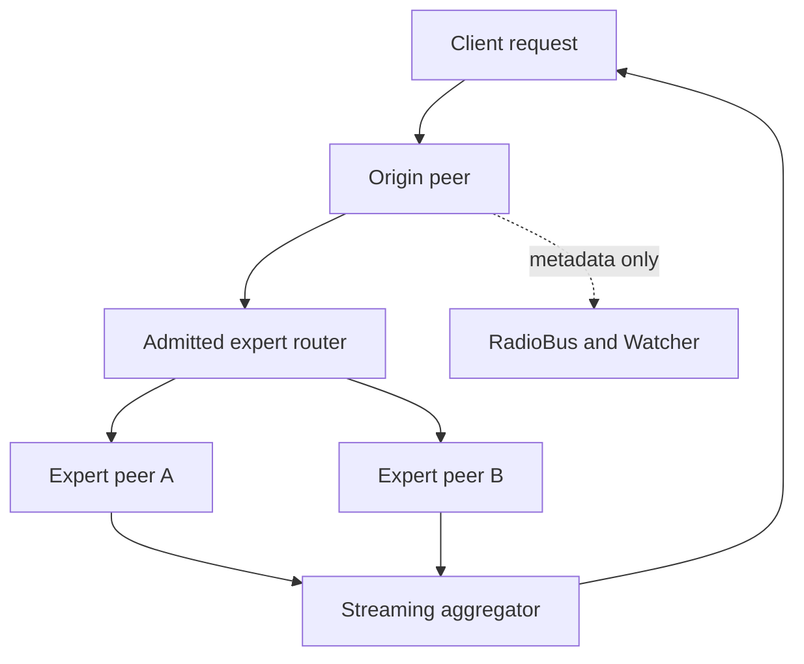

# ADR-395 — Radio real-time streaming peer expert mesh

- Status: Accepted for reference implementation
- Date: 2026-08-16
- Decision owners: Autogenous maintainers
- Related: ADR-391, ADR-392, ADR-393, ADR-394 (crypto closure), ADR-396, ADR-397 (streaming mixture of agents), ADR-398 (applications)

> Numbering note: the mixture-of-agents P2P work lives in this **autogenous**
> repository under `packages/radio-moe` (a TypeScript npm package; not a cargo
> workspace member, so `cargo` ignores it). This ADR family is **395–398**;
> **394** is the separate cryptographic-closure-of-the-promotion-path ADR. These
> were drafted as 394–397 before landing here — renumbered on relocation to avoid
> colliding with 394. The earlier standalone `mora`/`radio-moe` MVP prototype is
> folded into this ADR.

## Context

Autogenous needs a bounded way to distribute inference across independently
operated expert peers while preserving its central invariant: optimization may
improve routing and composition, but it may not grant itself new authority.

`@metaharness/radio@0.1.0` supplies a deterministic in-process `RadioBus`, ordered
thread messages, mentions, and passive `Watcher` folds. It does **not** supply
network discovery, peer authentication, encrypted transport, replay protection,
backpressure, or distributed consensus. Treating Radio itself as a P2P network
would therefore create a **false security boundary**. (Confirmed against the
published `.d.ts`: RadioBus holds threads/messages in memory with a logical `seq`
clock — an awareness plane, not a transport.)

The term *mixture of experts* also needs precision. Heterogeneous hosted models
normally expose text deltas, not aligned token logits. Their text cannot be
mathematically mixed token by token. A **true streaming mixture** is possible only
when participating experts declare the same tokenizer and return bounded logit
vectors for the same token position. Text-only experts can be raced, selected,
shadowed, or judged, but that is an **ensemble**, not a neural MoE.

## Specification

### Outcome and business value

Create a real-time expert mesh that can:

1. Route one request to the best `k` admitted expert peers.
2. Stream results without a central inference proxy.
3. Perform weighted token-probability mixing when experts share a tokenizer.
4. Provide safe text-primary racing with shadow experts otherwise.
5. Preserve signed identity, deadlines, replay resistance, bounded resources,
   Radio awareness, cancellation, and audit evidence.
6. Allow Autogenous to evolve routing weights without allowing peers to
   self-admit or expand capabilities.

Expected value: lower tail latency, improved availability, jurisdiction-aware
placement, and access to specialized models without centralizing every token
stream. Initial overhead targets: below 5 ms inside a LAN (excluding expert
inference) and below 2 % additional bytes for protocol metadata on normal text
streams.

### Actors

- **Origin peer** — accepts the client request, owns final output semantics.
- **Expert peer** — runs one or more locally admitted experts.
- **Constitutional verifier** — signs bounded expert admission receipts.
- **Radio control plane** — records metadata-only route, lifecycle, health, and
  security events inside each peer.
- **Peer transport** — carries signed request and stream envelopes directly
  between peers.
- **Autogenous evaluator** — measures route quality and proposes bounded routing
  mutations.

### Inputs / Outputs

Inputs: prompt or structured inference input; required capability, jurisdiction,
tokenizer, cost, latency, quality, trust policy; signed expert manifests and
admission receipts; peer trust roots and direct peer endpoints.

Outputs: incremental text deltas from one selected text primary, **or** weighted
token decisions from a compatible logit quorum; route/lifecycle metadata in Radio;
signed transport evidence for later witness-chain integration; explicit errors
when quorum, deadline, signature, sequence, or compatibility rules fail.

### Constraints and non-goals

- Radio carries bounded control metadata — never prompts, logits, raw model
  output, keys, or executable mutations.
- Remote peer manifests are never trusted because a peer announces them; they
  require a receipt from a configured verifier key.
- Accepting a response implies no cross-peer capability delegation.
- The initial TCP adapter provides direct networking and message authentication,
  **not** confidentiality. Internet deployment requires QUIC + mutual TLS or an
  equivalent encrypted adapter.
- NAT traversal, public discovery, billing settlement, Byzantine consensus, and
  autonomous source-code mutation are out of scope for this reference.
- Text streams are never spliced after the primary has emitted output. A failure
  after first output **fails closed** — switching prose mid-answer can silently
  corrupt meaning.

## Pseudocode

```text
admit expert manifest:
  hash canonical manifest
  verify receipt subject hash, verifier identity, constitution, and expiry
  verify Ed25519 signature against configured verifier key
  insert manifest into local read-only routing registry

open inference:
  validate request policy and deadline
  filter admitted manifests by capability, trust, quality, cost, expiry, tokenizer
  rank candidates using fixed constitutional weights
  select top k and normalize their route weights
  create metadata-only Radio thread
  send signed request.open envelope directly to each selected peer

expert peer receives request.open:
  validate shape, recipient, clock skew, expiry, signature, replay id, monotonic sequence
  verify the requested expert is locally admitted and capability-compatible
  start a cancellable local expert stream
  sign and send each bounded stream delta directly to the origin
  send a signed end or error envelope

text-primary aggregation:
  select highest-ranked expert as primary
  buffer a bounded amount from shadows before first primary output
  if primary fails before output, promote the next healthy shadow
  if primary fails after output, fail closed
  cancel remaining peers on completion or caller cancellation

logit-mixture aggregation:
  require one tokenizer id across every selected expert
  for each token position, wait for the configured quorum until the token deadline
  softmax each bounded expert logit vector
  compute weighted probability sum using admitted route weights
  emit the highest-probability token id and contribution evidence
  fail closed on missing quorum, incompatible tokenizer, invalid number, or deadline
```

**Success walk:** two admitted peers receive a request, both stream position-0
logits under the same tokenizer, the origin verifies both envelopes, reaches
quorum, mixes probabilities using normalized route weights, emits one token
decision, and cancels remaining work after the final position.

**Failure walk:** an attacker replays a valid `request.open`. The first envelope
advances the sender sequence and replay window. The duplicate event id is rejected
before expert invocation, a metadata-only security event is recorded in Radio, and
no second execution begins.

## Architecture



### Component ownership

| Component | Owns | Must not own |
|---|---|---|
| Radio control plane | Ordered local lifecycle awareness | Network trust, raw inference data, promotion authority |
| Trusted registry | Verified manifests + admission expiry | Dynamic peer self-registration |
| Router | Deterministic filtering + ranking | Admission, key creation, expert execution |
| Peer transport | Delivery, framing, backpressure | Mutation or expert authorization |
| Mesh node | Signature, replay, sequence, deadline enforcement | Constitutional changes |
| Aggregator | Text-primary or logit-quorum semantics | New capabilities or evaluator scores |
| Expert adapter | Local model invocation | Routing or peer admission |

### Trust boundaries

1. Client → origin peer.
2. Origin peer → local constitutional registry.
3. Peer transport → signed-envelope verifier.
4. Verified envelope → local expert invocation.
5. Expert stream → output aggregator.
6. Runtime evidence → future Autogenous promotion logic.

No boundary trusts fields merely because they are typed. Identity and admission
are cryptographically bound; runtime quality remains an *evaluated* property.

## Alternatives considered

| Alternative | Latency | Delivery cost | Security | Decision |
|---|---|---|---|---|
| Put all stream data in RadioBus | Low in one process | Low | Poor across peers, unbounded snapshots | Rejected |
| Central gateway for every expert | 20–100 ms WAN concentration | Medium | Simpler, but central trust + failure point | Retained as optional topology |
| libp2p immediately | Good after setup | High initial complexity | Strong ecosystem, larger surface | Defer until protocol stabilizes |
| Direct signed TCP reference adapter | Low on trusted networks | Low | Integrity only, no confidentiality | Selected for executable reference |
| QUIC + mutual TLS | Best production target | Medium–high | Strong confidentiality + identity | Required production follow-up |

## Rollout and rollback

1. Local in-memory conformance tests.
2. Signed TCP peers on loopback.
3. Shadow mode, no client-visible expert mixing.
4. Text-primary failover for ≤ 1 % of requests.
5. Logit mixing only for explicitly compatible local models.
6. Roll back by disabling mesh routing and restoring the single-endpoint route
   (no data migration required).

## Acceptance criteria

1. Two direct peers stream a text response end to end.
2. Two compatible logit experts produce a deterministic weighted token result.
3. A forged envelope never invokes an expert.
4. A replayed envelope invokes an expert at most once.
5. An expired or out-of-order envelope is rejected.
6. A text primary may fail over only before emitting output.
7. Missing logit quorum fails within its bounded deadline.
8. Radio snapshots contain no prompt or output text.
9. A real loopback TCP peer transfer passes with backpressure and frame limits.

## Consequences

The architecture gains a concrete distributed execution surface without pretending
Radio is a network protocol. It supports real token mixing where model interfaces
permit it and safely degrades to text racing elsewhere. The main operational cost
is maintaining peer trust roots, encrypted production transport, compatible
tokenizer groups, and bounded state for every active request.

## Reference implementation and evidence

The implementation lives in `packages/radio-moe`. The security model,
threat table, protocol invariants, and evolvable/non-evolvable parameters are
specified in **ADR-396**; the MidStream-based continuous mixture-of-agents
extension is **ADR-397**.

| Requirement | Implementation | Evidence |
|---|---|---|
| Radio metadata-only control plane | `src/radio-control.ts` | Mesh test proves prompt text is absent from snapshots |
| Constitution-pinned expert admission | `src/governance.ts` | Receipt binding, stale receipt, effective-expiry tests |
| Deterministic bounded routing | `src/router.ts` | Capability + tokenizer routing test |
| Signed direct envelopes | `src/crypto.ts`, `src/mesh.ts` | Tamper, forgery, key-order, prototype-shaped-key tests |
| Replay + sequence resistance | `src/replay.ts`, `src/mesh.ts` | Duplicate + lower-sequence execution test |
| Text primary + safe failover | `src/mesh.ts` | Success, pre-output failover, post-output fail-closed tests |
| True logit mixture | `src/mesh.ts` | Two-expert weighted quorum + missing-quorum failure tests |
| Cancellation | `src/mesh.ts` | Caller cancellation reaches the active expert signal |
| Direct P2P reference transport | `src/transport.ts` | Framing, size limit, two-node TCP stream tests |
| Reproducible dependency surface | exact npm lockfile | CI: `npm ci`, typecheck, tests, production audit |
