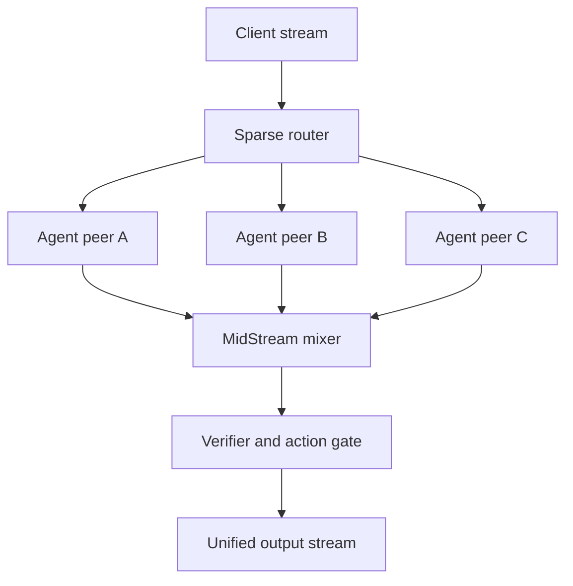

# ADR-397 — Autogenous Streaming Mixture of Agents (MidStream mixture plane)

- Status: Accepted for reference implementation (design + phased build)
- Date: 2026-08-16 · Updated: 2026-08-16 — novelty claim adversarially verified (see §Novelty)
- Decision owners: Autogenous maintainers
- Related: ADR-395, ADR-396 (this repo); ruvnet/midstream; @metaharness/radio (AgentRadio)

## Context

ADR-395/395 give a signed, governed peer expert mesh with two aggregation
profiles: `text_primary` (an ensemble race) and `logit_mix` (true token-probability
mixing where a tokenizer is shared). Neither yet delivers *continuous* fusion of
in-flight agent reasoning. MidStream is the missing component.

**Grounding (primary source, not memory).** `ruvnet/midstream` is a Rust real-time
stream-analysis platform ("analyzes responses as they stream … pattern detection …
decision-making"). Its ADRs confirm the load-bearing capabilities this design
relies on: **QUIC via quinn** (midstream ADR-0021, TLS verification ADR-0011),
**bounded backpressure** (ADR-0007), **streaming input bounds** (ADR-0012),
zero-copy byte streaming (ADR-0006), and a scheduler SLO contract (ADR-0033).
`midstreamer@0.3.1` publishes "WASM bindings for temporal comparison, scheduling,
and meta-learning + real QUIC transport via agentic-flow." That makes MidStream a
**mixture plane**, not merely a transport.

**The premise this ADR rejects:** mixing agent *prose* is not a mixture. A true
mixture requires every agent to emit a compatible incremental representation that
can be scored and fused while execution is still underway.

## Decision

Introduce the **Autogenous Streaming Mixture of Agents**: a governed, peer-operated
streaming mixture where routing can evolve but authority cannot.



| Layer | Responsibility |
|---|---|
| Radio | Peer awareness, route negotiation, health, mentions, cancellation |
| MidStream | QUIC streams, alignment, scoring, fusion, backpressure, intervention |
| Agent peers | Reasoning, tools, retrieval, specialist inference |
| Autogenous | Admission, routing evolution, constitutional gates, rollback |
| RVF / RVM | Portable agent packaging and capability enforcement |

### Agent mixture contract

Every agent streams typed `AgentFrame` objects rather than unrestricted prose
(implemented in `src/agent-frame.ts`):

```ts
interface AgentFrame {
  requestId: string; agentId: string; step: number;
  kind: "claim" | "evidence" | "plan" | "action" | "logits";
  value: unknown; confidence: number; uncertainty: number;
  dependencies: string[]; capabilityUsed: string;
  evidenceHashes: string[]; cost: number; signature: string;
}
```

MidStream maintains a rolling state `S_t = {F_{1,t}, …, F_{k,t}}` and a gating
function assigning dynamic weights:

```
g_i(t) = softmax( α·q_i + β·r_i + γ·e_i − δ·c_i − ε·l_i − ζ·u_i )
```

where `q`=historical quality, `r`=relevance to current state, `e`=evidence
strength, `c`=cost, `l`=latency, `u`=uncertainty. The mixture is
`Z_t = Σ_{i∈TopK(S_t)} g_i(t)·φ(F_{i,t})`, where `φ` maps claims/evidence/plans/
logits into a common intermediate representation and a decoder turns `Z_t` into the
next visible token, claim, plan update, or **authorized action**.

### Three mixture levels

1. **Claim mixture** — agents stream claims + evidence; MidStream merges compatible
   claims, detects contradictions, adjusts confidence, continuously updates the
   answer. *Works with commercial models today* (e.g. `claude -p`/`codex exec`
   streaming, `src/streaming-experts.ts`).
2. **Action mixture** — agents propose tool actions; MidStream compares proposals +
   evidence; the verifier releases only the highest-scoring constitutionally
   admissible action. *Strongest enterprise case: combines intelligence without
   combining authority.*
3. **Token mixture** — agents expose aligned token logits; MidStream mixes
   probabilities per position (ADR-395 `logit_mix`). Closest to neural MoE, but
   requires identical tokenizer, vocabulary, sampling policy, and preferably
   compatible model families. Most commercial APIs do not expose enough.

### Governed collective action

An action is released only when evidence and authorization pass:

```
Execute(a) = Admissible(a) ∧ IndependentSupport(a) ≥ 2 ∧ Risk(a) < τ
```

### P2P topology

Pure decentralization would require every peer to agree on ordering, weights, and
committed actions — roughly one to two network round trips of consensus latency per
decision. The practical architecture:

1. Direct P2P agent streams.
2. A **request-scoped mixer** selected from the peers.
3. Deterministic replicated mixture state on one **shadow** peer.
4. Signed output sequence numbers.
5. Shadow takeover if the mixer fails.
6. Autogenous governance above both.

This removes the permanent central gateway without paying Byzantine consensus per
token.

## Expected operating envelope

| Metric | Initial target |
|---|---|
| Active experts | 2–6 |
| Agent-frame cadence | 20–100 ms |
| Mixing window | 10–30 ms |
| Added LAN latency | 5–20 ms |
| Added WAN latency | 25–100 ms |
| Compute multiplier | 1.3–3× (sparse routing; ~1.5–2.5× typical) |
| Mixer failover | < 250 ms |
| Action quorum | ≥ 2 independent agents |

Sparse routing and early cancellation are essential: running four full agents per
request costs ~4×; routing two specialists plus one inexpensive judge holds cost
near 1.5–2.5×.

## Critical prerequisite

MidStream's streaming-bounds and backpressure work (its ADR-0007 / ADR-0012) must
be complete before exposing this to hostile peers — message size, stream lifetime,
rate, and accumulator limits are the protections against memory exhaustion. QUIC
0-RTT data must carry only replay-safe observations and availability messages; it
must **never** activate agents, grant capabilities, execute tools, or change
routing policy.

## Biggest technical uncertainty — semantic alignment

Semantic alignment is harder than networking. Two agents can use the same words
while representing different assumptions, evidence scopes, or confidence meanings;
averaging their scores can create **false consensus**. The fix is the canonical
intermediate representation carrying: claim identity, evidence references,
assumptions, confidence calibration, contradictions, dependencies, capability use,
jurisdiction, expiry, and signature. Without it the architecture is a fast
conversation bus; with it, a genuine mixture system.

The related failure mode: three agreeing agents may be one correlated error, not
three independent confirmations. Quorum must measure evidence independence, model
diversity, source overlap, and historical calibration **before** counting.

## Novelty (honest claim)

Prior art exists separately: Mixture-of-Agents (output aggregation across
proposer/aggregator layers, not continuous peer streaming); Distributed MoA /
AgentNet (decentralized gossip of prompts/outputs); AgentRadio (live asynchronous
awareness, not continuous fused output); Differentiable MoA (adaptive collaboration
topology, but not signed peer transport + inflight processing + constitutional
admission + action authority + reversible route evolution).

The defensible claim is therefore **"an open, governed peer-to-peer streaming
mixture of agent trajectories that continuously combines signed claims, evidence,
confidence, and action proposals while execution is underway."** Do **not** claim
first P2P agent system, first MoA, or first streaming agent protocol.

**Adversarially verified (2026-08-16)** — a 24-source, 25-claim deep-research
pass (3 independent verification votes per claim; 21 confirmed / 3 refuted /
1 unverified) supports this positioning per pillar: continuous claim-level
mid-stream fusion — **genuinely novel** in the surveyed corpus; signed frame
provenance — **partially done** (ANP signs per-message with ECDSA-secp256r1;
AIP proves ed25519 at 0.049 ms/verify; **no deployed interop protocol mandates
per-message claim provenance**, and MCP misbinding is measured at VR up to
1.0); independence-weighted quorum — **empirically motivated, unbuilt
anywhere** (ICML 2025: ~60% same-wrong-answer agreement; provider/architecture/
size predict correlation); governed action release — **closest to done** (AIP),
whose two conceded gaps (self-reported completions, TTL-window replay) our
quorum-before-release design targets. Full findings, refuted claims (do not
repeat: ANP proxy-side verification; "A2A wholly unverifiable"; the Knostic
~2,000-servers figure), caveats, and derived build items:
[docs/research/2026-08-16-streaming-mixture-sota.md](../research/2026-08-16-streaming-mixture-sota.md).
Design mandates folded in from the same pass: **feed experts deliberately
decorrelated evidence** (shared context accelerates diversity collapse —
ReM-MoA ablation), and **fusion positioning must be selective** (naive
per-token ensembling degrades long-form output).

## Acceptance test

Three peers receive complementary private evidence that no individual peer can solve
alone. The system must: produce the correct answer **before** all peers complete;
identify each contribution and weight; survive mixer failure; outperform the
strongest single peer by **≥ 10 %**; reduce time-to-first-correct-decision by
**≥ 25 %**; reconstruct every visible claim to signed evidence; and execute **zero**
external actions without the configured independent authority quorum.

## Reference implementation status

- `src/agent-frame.ts` — the AgentFrame contract + canonical signing (**done**).
- `src/streaming-experts.ts` — `claude -p` / `codex exec` streaming backends →
  signed AgentFrames + `endlessMixLoop` (**done**, offline-tested).
- MidStream mixer (`φ`, gating `g_i(t)`, `Z_t`), request-scoped mixer + shadow
  takeover, signed output sequence, independence-aware quorum — **phased next**,
  built on the ADR-395/395 protocol core (crypto/replay/governance/router).
